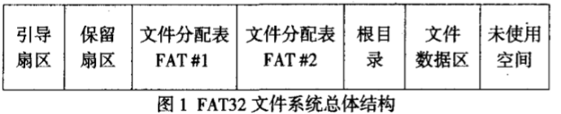
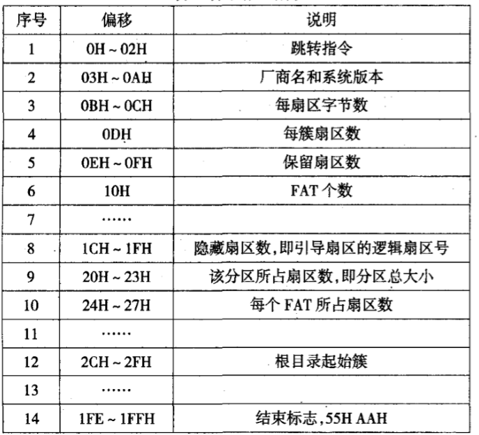
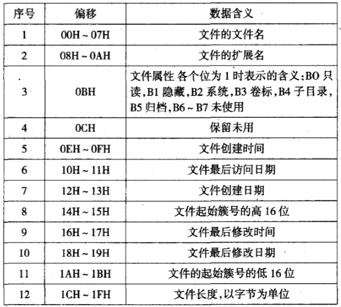

# 第1节：FAT32文件系统总体结构

## 1.1概述

  FAT32文件系统由引导扇区，文件分配表FAT，根目录，数据区和保留扇区组成如图一所示：

## 1.2 引导扇区

  引导扇区含有JMP指令、厂商信息、BPB参数块、FAT32区段和结束标志。
数据结构为：

如图1所示，根目录通常位于第二个FAT之后。由此，我们可以由表1引导扇区信息中的保留扇区数、FAT个数、每个FAT所占扇区数来定位到根目录的起始位置。
即根目录起始位置=保留扇区数+FAT个数*每个FAT所占扇区数。这里的根目录起始位置是相对于引导扇区而言的。

## 1.3 文件分配表FAT

  文件分配表由FAT表项组成。在FAT32文件系统中，每个FAT表项占用32位。每个FAT表项都对应着一个簇号。而且，当FAT表项的值为00000000H时表示对应的簇是空簇，未被分配使用，当值为0FFFFFFFH时表示对应的簇是某文件的最后一个数据簇。当值为00000001H—OFFFFFEFH时表示该簇已分配使用，且该FAT表项值是对应文件的下一个数据簇的簇号。
  在FAT文件系统中，系统通过FAT链来读取和写入文件数据。文件系统在目录项中存放着文件数据的起始簇号，在FAT区中，该起始簇号对应的FAT项中记录着该文件占用的下一个簇的簇号，该簇号对应 的FAT项中又记录着文件数据占用的下一个簇的簇号，一直到下一个簇号所对应的FAT表项值是结束标志0FFFFFFFH为止，这个FAT链才算结束。这样，系统在访问文件数据时，首先找到该文件的目录项，从中找出起始簇号，然后根据对应的FAT链就可以找出文件的所有数据簇：簇号和FAT项的对应关系为：簇号乘以4，将乘积作为相对文件分 配表起始位置的偏移(从0开始计算)，就找刭了该簇号对应的FAT项。

## 1.4 目录项

  操作系统通过目录树结构来管理一个分区中的文件，根节点存放盘符，每一个叶节点存放一个文件，而中间节点则是文件夹。从根节点到叶节点的路径就形成了该文件的绝对路径。这种管理方法对应于磁盘上，就是文件系统创建根目录区，根目录区中的每一个目录项指示目录树中根节点下的一个文件或文件夹的各种属性和数据的存放位置。文件夹，又叫做子目录。它对应的目录项中所指向的数据起始簇中的内容不是数据而是该文件夹内的各个文件的目录项。同样，子目录下的目录项集合中还可以有子目录目录项，这样的子目录目录项所指向的数据起始簇内，同样存放着一个目录项集合。FAT32文件系统通过这种方式来管理和组织一个个的文件。不管是根目录下的目录项还是子目录中的目录项，大小均为32字节，其数据结构及表示的含义是相同的。
  目录项的结构如表所示：

  根据上面的目录项信息，我们可以得到文件的起始簇号和文件大小。这两个数据对文件数据的恢复至关重要。